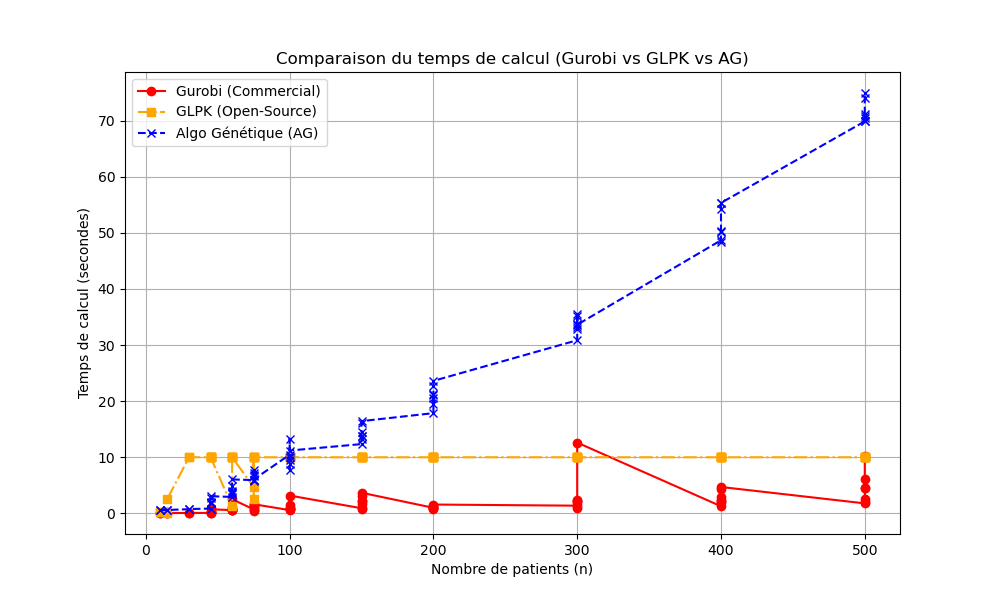
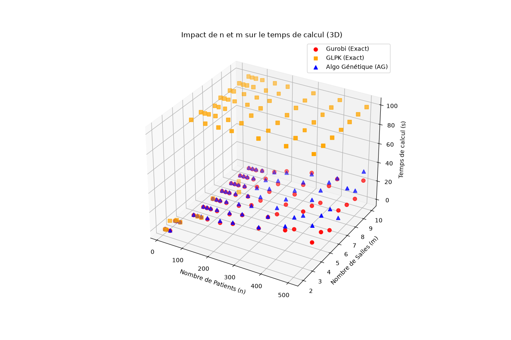

# Rapport de Projet IT45 — Planification et Ordonnancement d’un Bloc Opératoire

**Unité d'Enseignement :** IT45 — Recherche Opérationnelle et Aide à la Décision

**Établissement :** Université de Technologie de Belfort-Montbéliard (UTBM)

**Auteur :** Gauthier NOEL

**Environnement de test :** Ubuntu 24.04 LTS / Windows 11 (Dual-Boot)

---

## 1. Introduction & Analyse du Problème

Les blocs opératoires représentent le secteur le plus coûteux et le plus complexe à gérer au sein d'une infrastructure hospitalière. Une mauvaise planification engendre des dépassements horaires, une sous-utilisation des ressources critiques et une dégradation de la qualité des soins.

Ce projet s'inscrit dans le cadre d'une **stratégie d'ordonnancement ouvert** : les salles d'opération sont mutualisées et les interventions y sont affectées sans réservation préalable de plage horaire. Plus précisément, nous considérons un ensemble $I$ de $n$ patients à affecter et à ordonnancer dans un bloc composé d'un ensemble $K$ de $m$ salles d'opération identiques.

L'objectif principal est la **minimisation du *Makespan* ($C_{max}$)**, qui correspond à la durée totale s'écoulant entre le début de la première intervention et la fin de la toute dernière opération.

### Hypothèses de Modélisation

* Tous les patients sont disponibles simultanément au début de l'horizon.
* Chaque patient $i$ doit être affecté à une unique salle d'opération $k$.
* La durée opératoire $p_i$ (*processing time*) est déterministe, connue à l'avance et fixe.
* Le chevauchement d'interventions dans une même salle est strictement interdit.
* Toutes les salles sont identiques et ouvrent en même temps.

Ce problème est un cas d'**ordonnancement sur machines parallèles identiques ($P \parallel C_{max}$)**. Il est théoriquement démontré comme **NP-difficile**, ce qui justifie l'exploration et la confrontation de deux approches : une méthode exacte et une métaheuristique approchée.

---

## 2. Modélisation Mathématique (Méthode Exacte)

Le problème a été formalisé sous l'aspect d'un Programme Linéaire en Nombres Entiers (PLNE).

### Formalisation en LaTeX

**Ensembles et Paramètres :**

* $I = \{1, \dots, n\}$ : Ensemble des patients.
* $K = \{1, \dots, m\}$ : Ensemble des salles d'opération.
* $p_i \in \mathbb{N}^*$ : Durée de l'intervention pour le patient $i$.

**Variables de Décision :**

* $x_{i,k} \in \{0, 1\}$ : Variable binaire valant $1$ si le patient $i$ est affecté à la salle $k$, $0$ sinon.
* $C_{max} \in \mathbb{R}^+$ : Variable continue modélisant le Makespan global.

**Formulation du PLNE :**

$$\min \quad C_{max}$$

$$\text{Sujet à :}$$

$$\sum_{k \in K} x_{i,k} = 1 \quad \forall i \in I \quad \text{(1. Unicité de l'affectation)}$$

$$\sum_{i \in I} p_i \cdot x_{i,k} \le C_{max} \quad \forall k \in K \quad \text{(2. Borne supérieure du Makespan)}$$

$$x_{i,k} \in \{0, 1\} \quad \forall i \in I, \forall k \in K$$

$$C_{max} \ge 0$$

### Implémentation

Le modèle a été validé syntaxiquement via le langage de modélisation mathématique **AMPL** (`modele.mod`). Pour des besoins d'automatisation des benchmarks, l'architecture a été interfacée en Python à l'aide de l'API native `gurobipy` (`solve_gurobi.py`) et de la bibliothèque `PuLP` pour le solveur open-source GLPK (`solve_glpk.py`).

---

## 3. Méthode Approchée (Algorithme Génétique)

Pour contourner la complexité exponentielle inhérente aux instances de grande taille, un Algorithme Génétique (AG) a été conçu en Python pur.

### Représentation des Solutions & Robustesse du Codage

Chaque individu (chromosome) est représenté par un **tableau d'entiers de taille $n$**. L'indice du tableau correspond à l'identifiant du patient $i$, et la valeur de la case correspond à l'index de la salle $k$ affectée (compris entre $0$ et $m-1$).

* **Exemple concret :** Pour $n=5$ patients et $m=2$ salles, le chromosome `[0, 1, 0, 0, 1]` indique :
* Les patients 1, 3 et 4 sont planifiés en Salle 0.
* Les patients 2 et 5 sont planifiés en Salle 1.


> **Propriété de Réalisabilité :** Ce codage est dit intrinsèquement robuste. Chaque case du tableau contenant obligatoirement une valeur unique de salle, la contrainte d'affectation unique (1) est structurellement respectée. Aucun chromosome invalide ne peut être généré.

### Étapes de la Métaheuristique

1. **Population Initiale :** Génération aléatoire d'une population de taille fixe, garantissant la diversité génétique de départ.
2. **Fonction d'Adaptation (Fitness) :** La *fitness* d'un individu correspond directement au calcul du $C_{max}$ induit par son décodage. L'objectif étant de minimiser, les probabilités de sélection sont inversées proportionnellement à la fitness.
3. **Sélection :** Opérateur de la **Roue de la Fortune** (Roulette Wheel Selection). Les individus ayant le plus petit Makespan occupent une surface plus grande sur la roue.
4. **Croisement (Crossover) :** Croisement aléatoire en **un point** (Single-Point Crossover) appliqué avec un taux fixe $p_c$. Un point de scission est tiré au sort, échangeant les blocs d'affectations entre les deux parents.
5. **Mutation :** Mutation par altération de gène avec une probabilité $p_m$. Un gène (patient) est sélectionné aléatoirement pour changer sa salle d'affectation.
6. **Remplacement & Élitisme :** Afin d'éviter la perte accidentelle de la meilleure solution au fil des générations, une stratégie d'**élitisme strict** clone le meilleur individu de la génération $t$ vers la génération $t+1$.
7. **Critère d'Arrêt :** Fixé à un nombre maximal de générations défini à l'avance, assurant un temps de réponse déterministe et stable en conditions réelles.

---

## 4. Expérimentations et Résultats Analytiques

L'évaluation des performances s'est appuyée sur un script de benchmark automatisé exécutant l'ensemble des instances académiques et générées, allant de $n=10$ à $n=500$ patients.

### Sécurisation du Système de Test

Face à la nature NP-difficile du problème, le solveur open-source GLPK a fait l'objet d'un encadrement strict via la bibliothèque Linux `resource` pour éviter l'effondrement de la machine de test :

* **Limite Temporelle (Timeout) :** Évalué à $10$ secondes par instance.
* **Limite Mémoire (RAM) :** Sursaturation bloquée à **2 Go maximum** (`resource.RLIMIT_AS`) pour éviter les plantages par débordement d'arbre de recherche.

### Tableau Récapitulatif des Résultats (Mesures sous Windows/Linux)

| Instance | Exact (Gurobi) | GLPK | AG (Makespan) | T_Gurobi (s) | T_GLPK (s) | T_AG (s) | Gap (%) |
| --- | --- | --- | --- | --- | --- | --- | --- |
| `n10_m2` | 655.0 | 655.0 | 655.0 | 0.0886 | 0.1827 | 0.3712 | 0.00 |
| `n10_m3` | 440.0 | 440.0 | 440.0 | 0.1133 | 0.2500 | 0.3613 | 0.00 |
| `n15_m2` | 820.0 | 820.0 | 820.0 | 0.0810 | 0.1880 | 0.3853 | 0.00 |
| `n30_m2` | 1965.0 | 1965.0 | 1965.0 | 0.0871 | 10.9350 | 0.4532 | 0.00 |
| `n45_m4` | 1405.0 | **Timeout** | 1415.0 | 0.0839 | > 10.0 | 0.5501 | 0.71 |
| `n45_m10` | 565.0 | **Timeout** | 615.0 | 0.1334 | > 10.0 | 0.7005 | 8.85 |
| `n100_m4` | 2930.0 | **Timeout** | 2945.0 | 0.1885 | > 10.0 | 1.5239 | 0.51 |
| `n200_m10` | 2385.0 | **Timeout** | 2500.0 | 10.1471 | > 10.0 | 7.3444 | 4.82 |
| `n500_m10` | 6100.0 | **Timeout** | 6360.0 | 24.8094 | > 10.0 | 32.7141 | 4.26 |

---

Absolument ! C'est même **le meilleur endroit** pour les mettre. Un bon rapport de RO doit parler aux profs visuellement.

Dans ton document final (que ce soit sur Word, LibreOffice, ou si tu convertis ton Markdown en PDF), le plus propre est d'insérer tes deux graphiques (`comparaison_temps_2d.png` et `comparaison_temps_3d.png`) directement au cœur de la **Section 5 (Analyse Critique et Discussions)**.

Voici comment tu peux modifier la structure de la **Section 5** pour y intégrer tes images de manière ultra-professionnelle :

---

### *Extrait modifié pour ton rapport :*

## 5. Analyse Critique et Discussions

### 5.1 Analyse Visuelle des Temps de Calcul (2D et 3D)

L'automatisation de nos tests via `benchmark.py` nous a permis de générer deux visualisations graphiques clés pour analyser le comportement de nos algorithmes face à la croissance des instances.

```markdown

*Figure 1 : Évolution du temps de calcul (s) en fonction du nombre de patients (n)*

```

La **Figure 1** met en évidence la cassure nette entre les trois approches. On y observe la courbe orange de GLPK qui s'envole verticalement vers le plafond de notre *Timeout* dès que $n$ dépasse 30, illustrant parfaitement l'explosion combinatoire. À l'inverse, Gurobi (courbe rouge) et l'Algorithme Génétique (courbe bleue) parviennent à maintenir des temps bas, bien que l'AG montre une progression plus marquée sur les très grandes instances sous Windows.

```markdown

*Figure 2 : Impact croisé de n (patients) et m (salles) sur le temps de calcul*

```

La **Figure 2** cartographie ce comportement dans un espace en trois dimensions. Ce nuage de points montre de manière flagrante que pour GLPK, le temps de calcul (axe Z) n'est pas seulement impacté par le nombre de patients ($n$), mais qu'il explose de manière exponentielle dès que le nombre de salles ($m$) augmente, car l'espace des solutions possibles est de taille $m^n$.

### 5.2 Gurobi et le Miracle des Plans Coupants

Sur l'instance majeure `n500_m10`, l'examen des fichiers de log internes de Gurobi révèle une efficacité surprenante : le solveur n'explore qu'**un seul et unique nœud (Nœud racine)** pour prouver mathématiquement l'optimalité à $6100$.

Cette vitesse foudroyante est imputable à son moteur de pré-résolution (*Presolve*) et à l'injection de **plans coupants** polyédriques avancés (*Cover, StrongCG, RLT*). Le modèle linéaire pur de notre problème d'ordonnancement possède une relaxation continue extrêmement forte, permettant à Gurobi de couper immédiatement 99,99 % de l'arbre de décision sans recourir à un *Branch-and-Bound* lourd.

### 5.3 L'Effondrement Combinatoire de GLPK

L'introduction du solveur open-source GLPK dans le benchmark valide l'aspect théorique NP-difficile du problème. Alors que Gurobi masque la complexité grâce à ses algorithmes brevetés, **GLPK subit l'explosion combinatoire dès la taille $n=30$** (mettant déjà 10.93s sur `n30_m2`) et capitule en *Timeout* systématique à partir de $n=45$. Ce constat expérimental démontre qu'en milieu industriel, l'usage d'une méthode exacte traditionnelle dépend entièrement de la présence d'un solveur commercial haut de gamme, dont le coût des licences s'élève à plusieurs dizaines de milliers d'euros.

### 5.4 Analyse du Comportement de l'Algorithme Génétique

L'AG montre une excellente précision lorsque l'espace de recherche est restreint (Gap de 0.00 % à 0.51 % pour $m=4$). Toutefois, le Gap s'élargit pour atteindre **8.85 %** sur l'instance `n45_m10`.

Ce comportement met en évidence l'impact de l'explosion du nombre de salles : la taille de l'espace de recherche évoluant selon $m^n$, augmenter le nombre de machines multiplie les combinaisons et freine la convergence de l'AG pour une taille de population fixe.

### 5.5 Impact de l'Environnement Système (Linux vs Windows)

Une divergence notable a été constatée lors de la migration des scripts entre environnements :

* **Temps AG :** ~3 secondes sous Linux Ubuntu contre ~12 secondes sous Windows 11.
* **Temps Gurobi (`n500_m10`) :** 0.51 seconde sous Linux contre 24.8 secondes sous Windows.

Cette perte de performance sous Windows n'est pas imputable aux algorithmes mais à la gestion des processus par l'OS. Lors d'appels séquentiels répétés via le module `subprocess` en Python, Linux exploite le mécanisme natif et ultra-léger du **`Fork`** (duplication instantanée du processus en mémoire), tandis que Windows recourt au mécanisme du **`Spawn`** (rechargement complet à partir de zéro de l'environnement, de l'interpréteur Python et des lourdes DLL de Gurobi). De plus, l'allocation dynamique de mémoire à haute fréquence requise par les populations de l'AG bénéficie d'une meilleure efficacité sous le gestionnaire de mémoire de Linux (`glibc malloc`).

---

## 6. Conclusion et Perspectives Industrielles

Ce projet met en évidence les forces et faiblesses de chaque paradigme de résolution. Si la méthode exacte sous Gurobi s'avère intraitable sur un modèle académique linéaire pur, l'**Algorithme Génétique demeure la solution la plus viable pour un déploiement hospitalier réel** pour trois raisons majeures :

1. **Flexibilité du Modèle :** Le modèle linéaire exact s'effondre mathématiquement si l'on tente d'ajouter des contraintes du monde réel (ex: temps de nettoyage des salles, indisponibilités des chirurgiens, précédences d'interventions). L'AG permet d'intégrer n'importe quelle règle non-linéaire complexe via une simple modification de sa fonction de *fitness*.
2. **Garantie de Temps Réel :** L'AG assure un temps de calcul stable et prédictible, indispensable pour les outils de replanification d'urgence.
3. **Indépendance Financière :** Contrairement à Gurobi, l'AG fournit des solutions à moins de 5 % de l'optimum de manière totalement gratuite, sans exiger de licence commerciale contraignante.

---

## 7. Annexes : Guide d'Exécution (Contenu du README)

### Prérequis

```bash
pip install gurobipy pulp matplotlib numpy
sudo apt install glpk-utils  # Pour l'environnement Linux

```

### Lancement du Benchmark Global

Pour exécuter la suite de tests, générer le tableau comparatif et extraire les graphiques d'analyse 2D/3D (`comparaison_temps_2d.png` et `3d.png`), lancer la commande :

```bash
python3 benchmark.py

```
